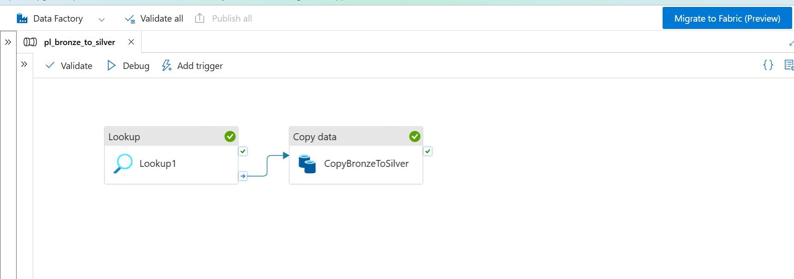
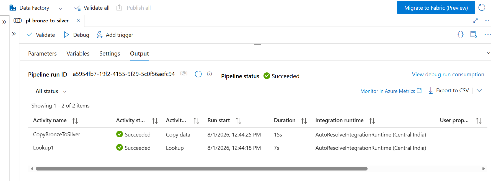
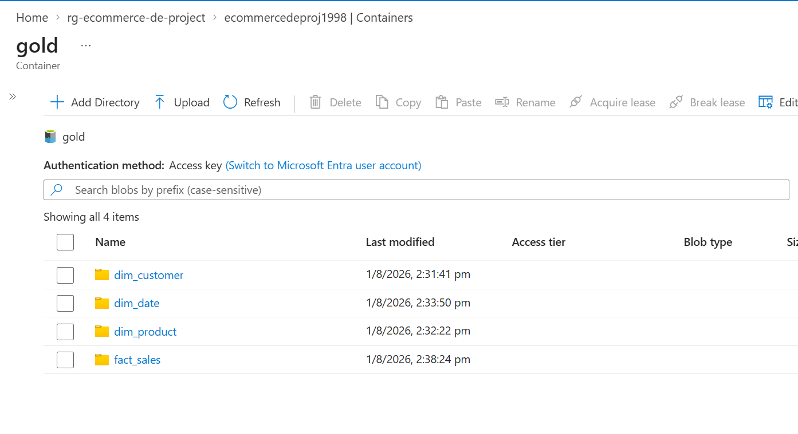
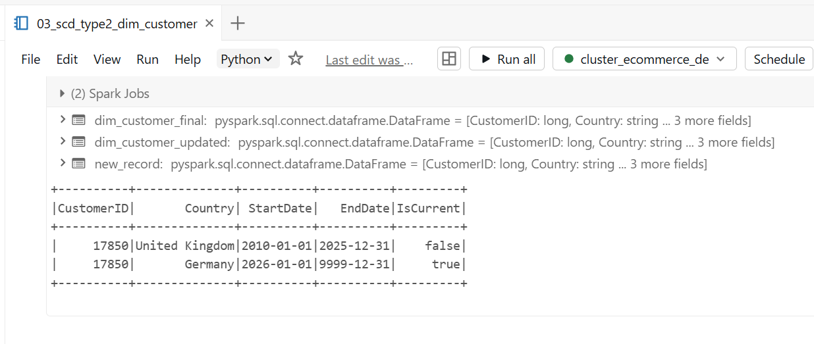

\# Azure E-commerce Data Pipeline

\## Overview

End-to-end batch ETL pipeline built on Azure, processing e-commerce

sales data through a Medallion architecture (Bronze -> Silver -> Gold),

serving cleaned data to Power BI dashboards.

\## Problem Statement

Raw e-commerce transaction data is messy - missing customer IDs,

returns represented as negative quantities, duplicate invoices.

This pipeline ingests, cleans, and transforms this data into

analytics-ready tables for business reporting.

\## Architecture

Source CSV -> Azure Data Factory -> ADLS Gen2 (Bronze)

\-> Databricks/PySpark (Silver - cleaned)

\-> Delta Lake (Gold - aggregated)

\-> Azure Synapse -> Power BI

\## Tech Stack

\- Azure Data Factory

\- Azure Data Lake Storage Gen2

\- Azure Databricks (PySpark, Delta Lake)

\- Azure Synapse Analytics

\- Power BI

\- Azure Key Vault (secrets management)

\## Dataset

UCI Online Retail Dataset (\~500K rows) - UK-based online retailer

transactions, Dec 2010 - Dec 2011.

\## Status: In Progress

\### Completed

\- \[x] GitHub repo setup

\- \[x] Azure account setup

\- \[x] Resource Group created

\- \[x] ADLS Gen2 Storage Account with bronze/silver/gold containers

\- \[x] Raw dataset uploaded to bronze layer

\- \[x] Azure Data Factory created

\- \[x] Linked Service connected to ADLS Gen2

\- \[x] Datasets created (Bronze source, Silver sink)

\- \[x] Copy Data pipeline (Bronze -> Silver) built and tested successfully

\- \[x] Azure Databricks workspace and cluster created

\- \[x] PySpark data cleaning notebook (handled nulls, negative quantities/returns, duplicates)

\- \[x] Cleaned data written to Silver layer as Delta table

- [x] Lookup Activity added to ADF pipeline (Bronze -> Silver)

- [x] Star Schema designed and documented

- [x] Star Schema built via PySpark (fact_sales, dim_customer, 
         dim_product, dim_date) written to Gold layer

- [x] SCD Type 2 implementation on dim\_customer

-[x] Aggregation in gold layer completed

\### Next

\- \[ ] Azure Synapse Analytics setup

\- \[ ] Power BI dashboard

\- \[ ] Azure Key Vault security implementation

\## Screenshots

!\[ADF Pipeline](docs/adf\_pipeline\_canvas.png)

!\[Debug Success](docs/adf\_debug\_success.png)

!\[Silver Container Output](docs/silver\_container\_output.png)
!\[Databricks Null Counts](docs/databricks\_null\_counts.png)

!\[Databricks Write Success](docs/databricks\_write\_success.png)

!\[Silver Cleaned Output](docs/silver\_cleaned\_output.png)

!\[ADF Lookup Pipeline](docs/adf\_lookup\pipeline.png)

