# 🛒 Azure E-Commerce Data Pipeline

> An end-to-end Azure batch ETL pipeline that transforms raw e-commerce transaction data into analytics-ready datasets using a **Medallion Architecture** and serves business insights through **Power BI**.

## 📌 Overview

This project processes raw e-commerce sales data through **Bronze → Silver → Gold** layers.

The pipeline handles data ingestion, cleansing, transformation, dimensional modeling, SCD Type 2, aggregations, and analytical reporting.

## 🎯 Problem Statement

Raw e-commerce transaction data contains:

- Missing customer IDs
- Duplicate invoices
- Returns represented as negative quantities
- Inconsistent and unclean transaction records

The pipeline cleans and transforms this raw data into reliable, analytics-ready datasets for business reporting.

## 🏗️ Architecture

**CSV Dataset → Azure Data Factory → ADLS Gen2 (Bronze) → Azure Databricks / PySpark (Silver) → Delta Lake (Gold) → Azure Synapse Analytics → Power BI**

### Medallion Architecture

**🥉 Bronze** → Raw source data stored in ADLS Gen2

**🥈 Silver** → Cleaned and validated Delta data

**🥇 Gold** → Star schema, historical dimensions, and business aggregations

## 🛠️ Technology Stack

| Technology | Purpose |
|---|---|
| **Azure Data Factory** | Data ingestion and pipeline orchestration |
| **ADLS Gen2** | Cloud data storage and Medallion layers |
| **Azure Databricks** | PySpark data processing and transformation |
| **Delta Lake** | Reliable Silver and Gold data storage |
| **Azure Synapse Analytics** | SQL analytics and serving layer |
| **Power BI** | Business reporting and dashboards |
| **Azure Key Vault** | Secrets and credential management |

## 📊 Dataset

**UCI Online Retail Dataset**

- Approximately **500K transactions**
- UK-based online retailer
- Period: **December 2010 – December 2011**
- Transaction-level e-commerce sales data

## ✅ Completed

- [x] GitHub repository setup
- [x] Azure account and Resource Group setup
- [x] ADLS Gen2 Storage Account created
- [x] Bronze, Silver, and Gold layers configured
- [x] Raw dataset uploaded to Bronze
- [x] Azure Data Factory created
- [x] ADLS Gen2 Linked Service configured
- [x] Bronze and Silver datasets created
- [x] Bronze → Silver Copy Data pipeline built and tested
- [x] Azure Databricks workspace and cluster created
- [x] PySpark data cleaning implemented
- [x] Null values, negative quantities/returns, and duplicates handled
- [x] Cleaned data written to Silver as Delta
- [x] ADF Lookup Activity added
- [x] Star Schema designed and documented
- [x] Gold layer built using PySpark
- [x] `fact_sales` created
- [x] `dim_customer` created
- [x] `dim_product` created
- [x] `dim_date` created
- [x] SCD Type 2 implemented for `dim_customer`
- [x] Gold-layer business aggregations completed
- [x] Azure Synapse Analytics configured
- [x] Synapse analytical views created
- [x] Sample SQL queries validated
- [x] Power BI dashboard completed
- [x] Azure Key Vault integrated for secret management

## ⭐ Key Data Engineering Concepts

**ETL / ELT** • **Medallion Architecture** • **ADLS Gen2** • **PySpark** • **Delta Lake** • **Star Schema** • **Fact & Dimension Tables** • **SCD Type 2** • **Data Cleansing** • **Data Quality** • **Data Aggregation** • **SQL Analytics** • **Pipeline Orchestration** • **Secrets Management** • **Business Intelligence**

## 📁 Project Structure

**`docs/`** — Pipeline, Databricks, Synapse, Key Vault, and Power BI screenshots

**`notebooks/`** — PySpark transformation and data engineering notebooks

**`pipelines/`** — Azure Data Factory pipeline definitions/documentation

**`README.md`** — Project documentation

## 📸 Screenshots

### Azure Data Factory
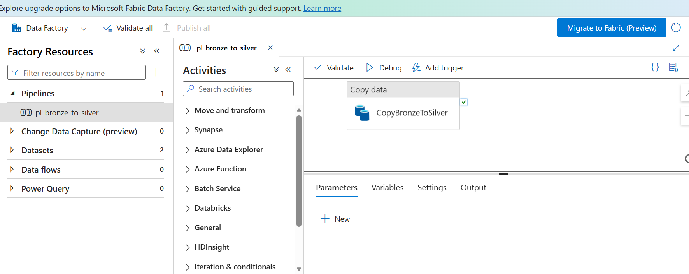

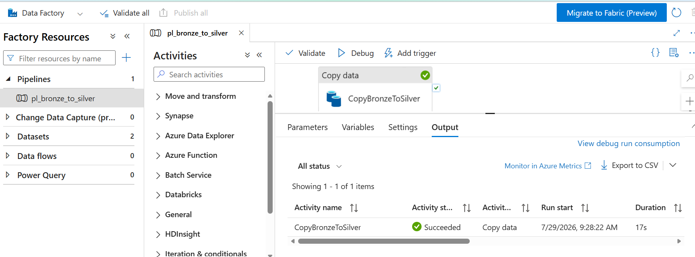

### Azure Databricks & Silver Layer
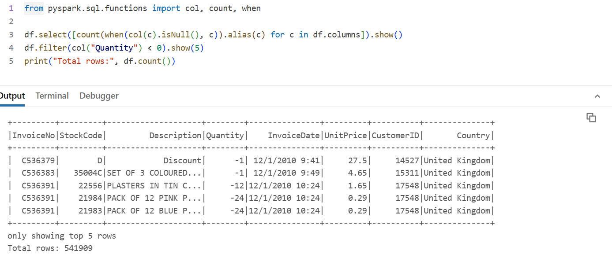

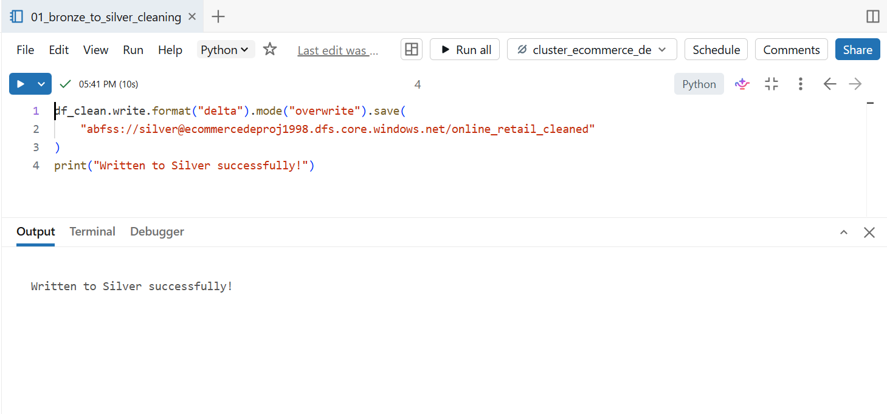

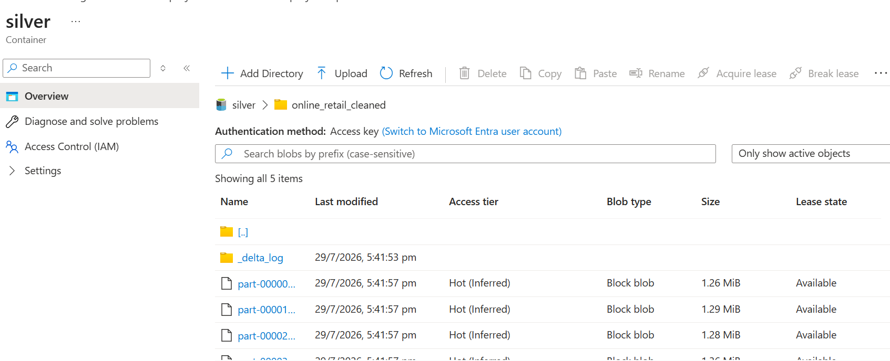

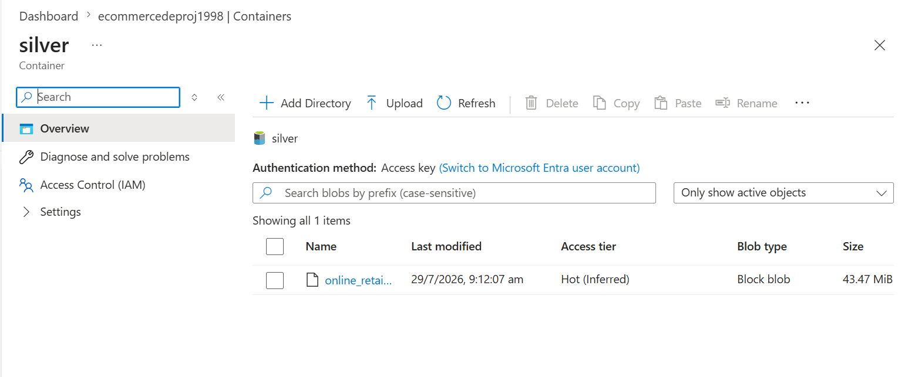

### Gold Layer & Data Modeling

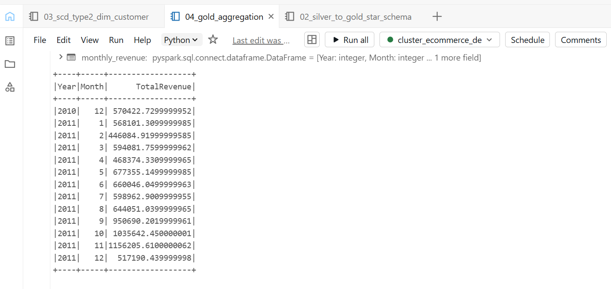

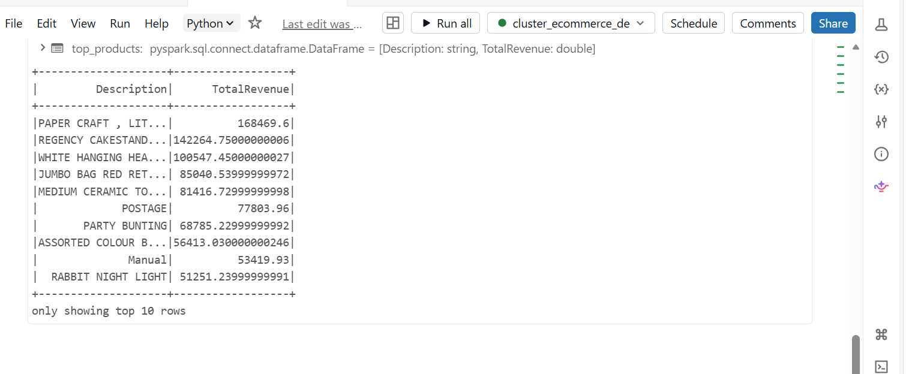

### Azure Synapse Analytics
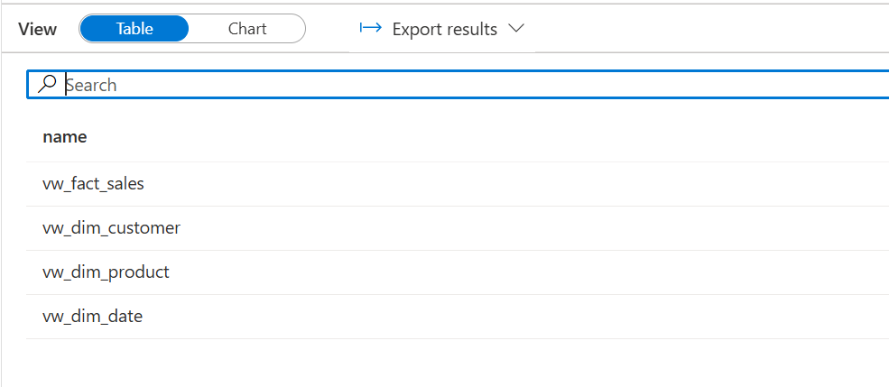

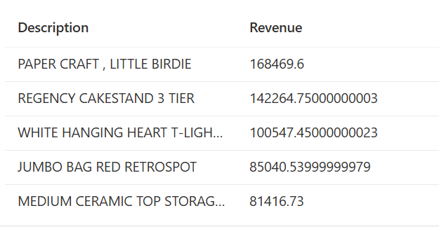

### Power BI

### Security
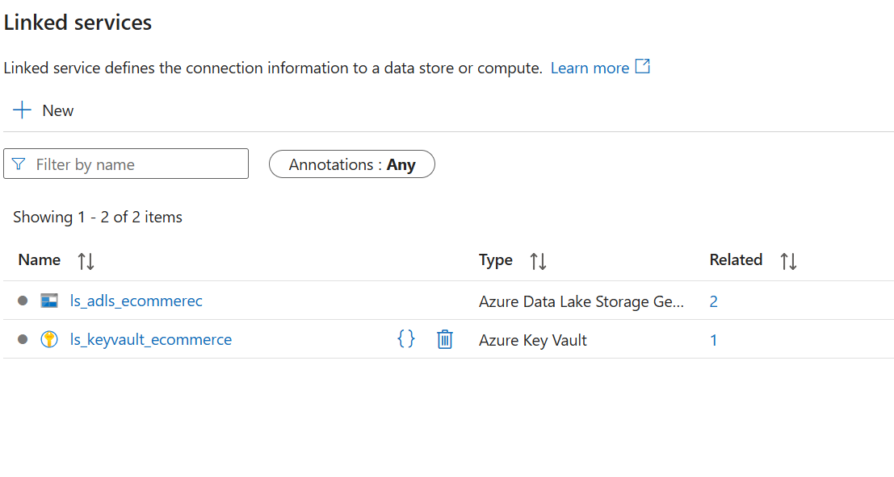

## 🎯 Learning Outcome

This project demonstrates practical experience in building an **end-to-end Azure data engineering pipeline**, from raw data ingestion and cleansing to dimensional modeling, historical data management, analytical serving, security, and business intelligence.

## 🚀 Project Status

**Completed ✅**